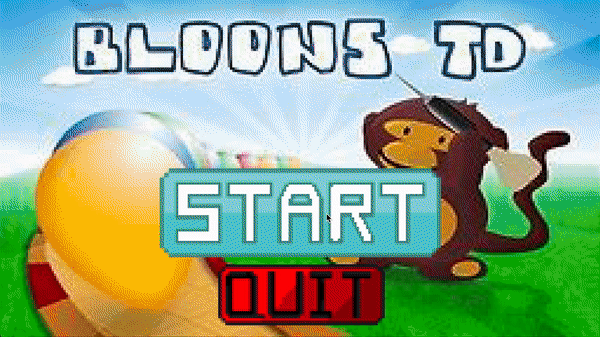
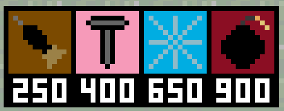
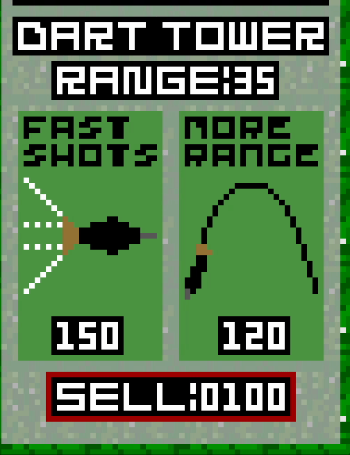
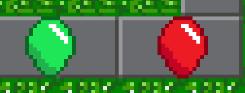
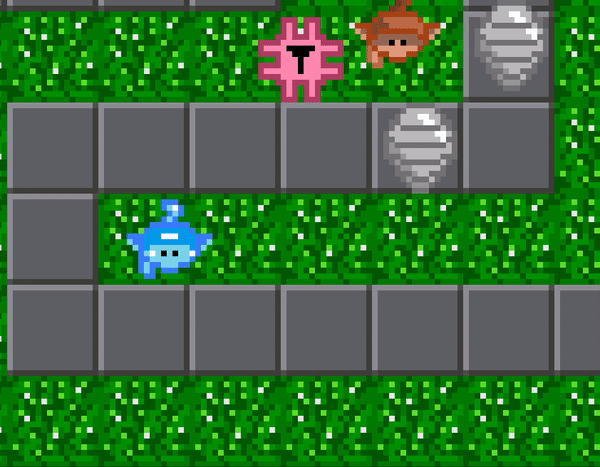
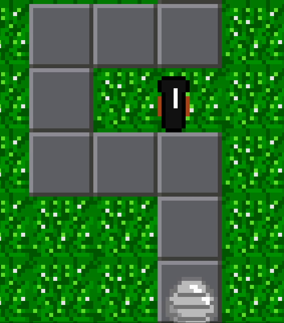
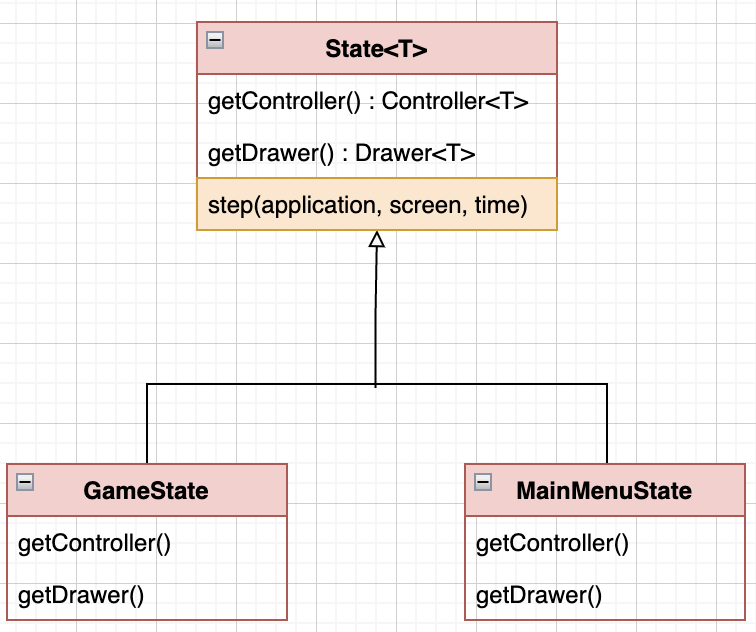
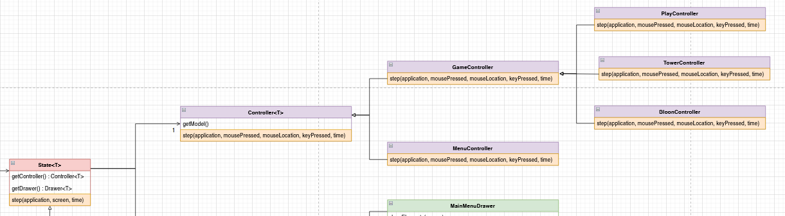
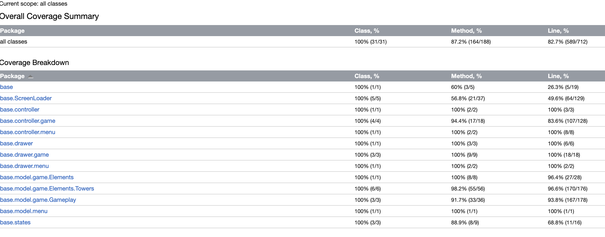
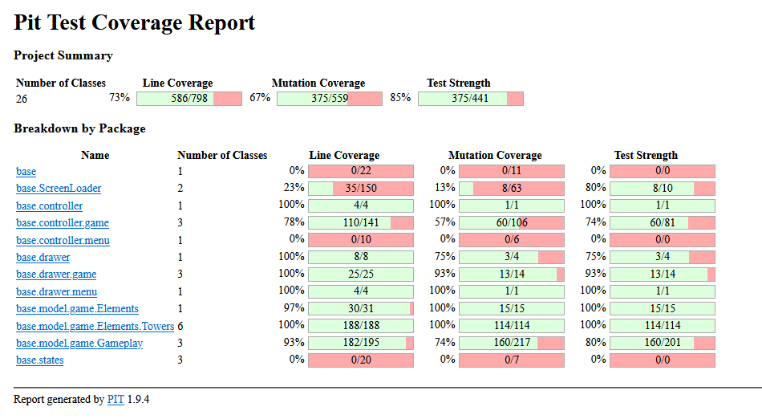

## LDTS_67 - Bloons Tower Defense: Prequel To The Prequel

In this project, you will be able to relive your long-lost joy in life by playing the good ol' Bloons TD. Here, you can fortify your defenses through the help of towers(some in the form of cute little monkeys) which will help you pop the balloons that are coming to get you!

This project was developed by [João Lourenço](https://www.github.com/Tonevanda) (up202108863@fe.up.pt), [Tiago Cruz](https://www.github.com/Tiago27Cruz) (up202108810@fe.up.pt) and [Tomás Xavier](https://www.github.com/dratomitoma) (up202108759@fe.up.pt) for LDTS 2022⁄23.

### TABLE OF CONTENTS

------

- [**Gameplay Demo**](https://github.com/FEUP-LDTS-2022/project-l06gr07/blob/main/docs/README.md#GAMEPLAY-DEMO)
- [**Implemented Features**](https://github.com/FEUP-LDTS-2022/project-l06gr07/blob/main/docs/README.md#IMPLEMENTED-FEATURES)
  - [**Tower**](https://github.com/FEUP-LDTS-2022/project-l06gr07/blob/main/docs/README.md#TOWER)
  - [**Bloon**](https://github.com/FEUP-LDTS-2022/project-l06gr07/blob/main/docs/README.md#BLOON)
  - [**Input**](https://github.com/FEUP-LDTS-2022/project-l06gr07/blob/main/docs/README.md#INPUT)
  - [**Other**](https://github.com/FEUP-LDTS-2022/project-l06gr07/blob/main/docs/README.md#OTHER)
- [**Planned Features**](https://github.com/FEUP-LDTS-2022/project-l06gr07/blob/main/docs/README.md#PLANNED-FEATURES)
  - [**Tower**](https://github.com/FEUP-LDTS-2022/project-l06gr07/blob/main/docs/README.md#TOWER-1)
  - [**Bloon**](https://github.com/FEUP-LDTS-2022/project-l06gr07/blob/main/docs/README.md#BLOON-1)
  - [**Other**](https://github.com/FEUP-LDTS-2022/project-l06gr07/blob/main/docs/README.md#OTHER-1)
- [**Design**](https://github.com/FEUP-LDTS-2022/project-l06gr07/blob/main/docs/README.md#DESIGN)
  - [**The Player Inputs Should Behave Differently Depending On The State Of The Game**](https://github.com/FEUP-LDTS-2022/project-l06gr07/blob/main/docs/README.md#THE-PLAYER-INPUTS-SHOULD-BEHAVE.DIFFERENTLY-DEPENDING-ON-THE-STATE-OF-THE-GAME)
    - [**Problem in context**](https://github.com/FEUP-LDTS-2022/project-l06gr07/blob/main/docs/README.md#PROBLEM-IN-CONTEXT)
    - [**The Pattern**](https://github.com/FEUP-LDTS-2022/project-l06gr07/blob/main/docs/README.md#THE-PATTERN)
    - [**Implementation**](https://github.com/FEUP-LDTS-2022/project-l06gr07/blob/main/docs/README.md#IMPLEMENTATION) 
    - [**Consequences**](https://github.com/FEUP-LDTS-2022/project-l06gr07/blob/main/docs/README.md#CONSEQUENCES)
  - [**Gameplay**](https://github.com/FEUP-LDTS-2022/project-l06gr07/blob/main/docs/README.md#GAMEPLAY)
    - [**Problem in context**](https://github.com/FEUP-LDTS-2022/project-l06gr07/blob/main/docs/README.md#PROBLEM-IN-CONTEXT-1)
    - [**The Pattern**](https://github.com/FEUP-LDTS-2022/project-l06gr07/blob/main/docs/README.md#THE-PATTERN-1)
    - [**Implementation**](https://github.com/FEUP-LDTS-2022/project-l06gr07/blob/main/docs/README.md#IMPLEMENTATION-1)
    - [**Consequences**](https://github.com/FEUP-LDTS-2022/project-l06gr07/blob/main/docs/README.md#CONSEQUENCES-1)
  - [**The Game Needs To Call The Correct Draw Method**](https://github.com/FEUP-LDTS-2022/project-l06gr07/blob/main/docs/README.md#THE-GAME-NEEDS-TO-CALL-THE-CORRECT-DRAW-METHOD)
    - [**Problem in context**](https://github.com/FEUP-LDTS-2022/project-l06gr07/blob/main/docs/README.md#PROBLEM-IN-CONTEXT-2)
    - [**The Pattern**](https://github.com/FEUP-LDTS-2022/project-l06gr07/blob/main/docs/README.md#THE-PATTERN-2)
    - [**Implementation**](https://github.com/FEUP-LDTS-2022/project-l06gr07/blob/main/docs/README.md#IMPLEMENTATION-2)
    - [**Consequences**](https://github.com/FEUP-LDTS-2022/project-l06gr07/blob/main/docs/README.md#CONSEQUENCES-2)
- [**Known Code Smells And Refactoring Suggestions**](https://github.com/FEUP-LDTS-2022/project-l06gr07/blob/main/docs/README.md#KNOWN-CODE-SMELLS-AND-REFACTORING-SUGGESTIONS)
  - [**BLOATERS - Large Class**](https://github.com/FEUP-LDTS-2022/project-l06gr07/blob/main/docs/README.md#BLOATERS---LARGE-CLASS)
  - [**DISPENSABLES - Lazy Class**](https://github.com/FEUP-LDTS-2022/project-l06gr07/blob/main/docs/README.md#DISPENSABLES---LAZY-CLASS)
- [**Testing**](https://github.com/FEUP-LDTS-2022/project-l06gr07/blob/main/docs/README.md#TESTING)
  - [**Coverage Report**](https://github.com/FEUP-LDTS-2022/project-l06gr07/blob/main/docs/README.md#COVERAGE-REPORT)
  - [**Mutation Testing Report**](https://github.com/FEUP-LDTS-2022/project-l06gr07/blob/main/docs/README.md#MUTATION-TESTING-REPORT)
- [**Self-Evaluation**](https://github.com/FEUP-LDTS-2022/project-l06gr07/blob/main/docs/README.md#SELF-EVALUATION)
### GAMEPLAY DEMO

------

### IMPLEMENTED FEATURES

------

#### TOWER
- **Towers** - We offer 4 different types of towers, all with their uniqueness of shooting, range and power. Some may even pop more than one layer at once!

- **Upgrades** - Each tower has two upgrades that offer two different advantages for your monkeys for a small amount of your cash.

#### BLOON
- **Layers** - Every bloon has at least 1 layer, however some bloons have layers on top of layers, dictated by their color, and you have to pop all layers to destroy that bloon.

- **Hard** - Some bloons are grey. This means they are hardened, so only some specific towers can damage them and pop that hard layer.

- *Hard layer not being popped by neither the DartMonkey, Ice, nor the Tack Tower*

- *Hard layer being popped by the Bomb Tower*

#### INPUT
- **Mouse press** - When the mouse is pressed and an action is valid (such as clicking the start game button), the game will now perform said action.
- **Press Escape** - Upon pressing escape, the game may:
  1) Close itself if you're in the main menu.
  2) Stop placing a tower after you've clicked on it on the shop.
  3) Stop selecting the tower you have selected at the moment. 
- **Valid Purchase** - You will only spend your hard-earned money while placing a new monkey if and only if you actually place it on a valid position, otherwise you still have time to avoid making a bad decision!

#### OTHER
- **Image loading** - Upon loading the game, the game loads the title-screen image.

### PLANNED FEATURES

------

#### TOWER
- **Rotate Tower** - When a bloon is moving and is in range of a tower, that tower would rotate, so it keeps facing that bloon.
- **Animation** - When attacking a bloon, an animation specific to that type of tower would play.
- **Sound-effect** - When attacking a bloon, a sound effect would play.

#### BLOON
- **Speed** - Depending on the amount of layers, the speed of the bloon would change.
- **MOAB** - M.O.A.B (*Massive Ornary Air Blimp*) is a huge blimp that carries bloons inside it and, when destroyed, those bloons would instantly appear and continue their march to end you!

#### OTHER
- **Infinite rounds** - Instead of ending at round 15, the game would continue on forever until the player lost.
- **High-score** - The game would keep track of the highest round reached.

### DESIGN

-------

#### THE PLAYER INPUTS SHOULD BEHAVE DIFFERENTLY DEPENDING ON THE STATE OF THE GAME

**Problem in Context**

Due to the nature of this project, one thing we had to do was implement the functions needed for the mouse to work properly (such as MousePressed and MouseHover), however, because we have two different menus, the main menu, with the Start and Quit buttons, and the game menu, when you are actually playing the game, there was a problem since we would have to test different mouse inputs for each type of menu because there were different buttons with different purposes from one menu to another. This would mean a never-ending stream of if statements to check where the player was. 

**The Pattern**

We decided to apply the **State** pattern. With this implementation of the **State** pattern, instead of constantly checking where the player is in the game (either in the Main Menu or the Game Menu) and then using that inform to process the mouse input in different ways, the game changes the **state** of the menu and, depending on the **state**, the game will behave differently to the mouse inputs it receives.

**Implementation**

These classes can be found in the following files:

- [State](https://github.com/FEUP-LDTS-2022/project-l06gr07/blob/main/src/main/java/base/states/State.java)
- [GameState](https://github.com/FEUP-LDTS-2022/project-l06gr07/blob/main/src/main/java/base/states/GameState.java)
- [MainMenuState](https://github.com/FEUP-LDTS-2022/project-l06gr07/blob/main/src/main/java/base/states/MainMenuState.java)

**Consequences**

The use of the State Pattern in the current design allows the following benefits:

- No need to rely on flags which make the code not seem fully fleshed out.
- No more complex if and switch statements that seem to go on forever.
- Although there are now additional classes and instances to handle, the amount is still manageable.

#### GAMEPLAY

**Problem in Context**

Given the nature of the project, one thing we had to do was add a lot of real-time functionality, such as the shooting delay for the towers and the location of our mouse or when it is pressed. In order for the bloons to move toward the end without any delay, we also needed to integrate fps. All of this would, however, need repeated calls to the ScreenLoader class, which implements the mouse listener, creating additional code everywhere to catch mouse events, and the use of user input to move the balloons.

**The Pattern**

We decided to apply the **Game Loop** pattern. With this implementation of the **Game Loop** pattern, instead of constantly accessing the ScreenLoader class, our mouse and key events are being constantly passed on by the function [step](https://github.com/FEUP-LDTS-2022/project-l06gr07/blob/main/src/main/java/base/states/State.java#L27-L34), class by class, without having the need for duplicate code or constant calls to ScreenLoader whenever we need to know the mouse’s location. Besides that, we are also able to use fps, which is essential to our game, since we have balloons that move by themselves, without the limitation of needing human input.

**Implementation**

The step method can be found in the following files:

- [State](https://github.com/FEUP-LDTS-2022/project-l06gr07/blob/main/src/main/java/base/states/State.java#L27-L34)
- [Controller](https://github.com/FEUP-LDTS-2022/project-l06gr07/blob/main/src/main/java/base/controller/Controller.java#L17-L18) 
- [MenuController](https://github.com/FEUP-LDTS-2022/project-l06gr07/blob/main/src/main/java/base/controller/menu/MenuController.java#L18-L29)
- [BloonController](https://github.com/FEUP-LDTS-2022/project-l06gr07/blob/main/src/main/java/base/controller/game/BloonController.java#L20-L34)
- [PlayController](https://github.com/FEUP-LDTS-2022/project-l06gr07/blob/main/src/main/java/base/controller/game/PlayController.java#L20-L31)
- [TowerController](https://github.com/FEUP-LDTS-2022/project-l06gr07/blob/main/src/main/java/base/controller/game/TowerController.java#L29-L33)

**Consequences**

The use of the Game Loop Pattern in the current design allows the following benefits:
- The game works without having to press anything for the balloons to move.
- No more complex calls to another class or duplicate code.

#### THE GAME NEEDS TO CALL THE CORRECT DRAW METHOD

**Problem in Context**

One thing we had to implement was always drawing and using the controller of the correct state, it being the main menu or game. However, this would mean a huge number of ifs and switches needed, so it always knows which state we are in.

**The Pattern**

We decided to apply the **Factory** pattern. With this implementation of the **Factory** pattern, instead of constantly checking which state we are on to appropriately draw and use the controller, our State class uses, for example, the getDrawer() function, that automatically knows which one to get.

**Implementation**

These classes can be found in the following files:
- [State](https://github.com/FEUP-LDTS-2022/project-l06gr07/blob/main/src/main/java/base/states/State.java)
- [GameState](https://github.com/FEUP-LDTS-2022/project-l06gr07/blob/main/src/main/java/base/states/GameState.java)
- [MainMenuState](https://github.com/FEUP-LDTS-2022/project-l06gr07/blob/main/src/main/java/base/states/MainMenuState.java)

**Consequences**
The use of the Factory Pattern in the current design allows the following benefits:
- The game knows which state it is and uses the correct version of the drawer and controller function.
- No more complex if and switch cases.

### KNOWN CODE SMELLS AND REFACTORING SUGGESTIONS

------

#### BLOATERS - Large Class

Currently, the [`Tower`](https://github.com/FEUP-LDTS-2022/project-l06gr07/blob/main/src/main/java/base/model/game/Elements/Towers/Tower.java) class is enormous, it has 12 class fields and 20 methods. As the development went on, the class started to get more and more bloated, and now it's a pain to refactor. 

A way to improve the code is to use the Extract Class and make it so that some methods in the Tower class would now be part of the new class.
This way, dividing up huge classes prevents code and functionality duplication.

#### DISPENSABLES - Lazy Class

Right now, the [`Menu`](https://github.com/FEUP-LDTS-2022/project-l06gr07/blob/main/src/main/java/base/model/menu/Menu.java) class does absolutely nothing, however it is not dead code. This class has no fields and no methods, only the default constructor. Even then, it is not useless, it is used as the context in the state class. Therefore, it's a lazy class.

Refactoring would imply the *Inline Class* or the *Collapse Hierarchy* treatments, since it has become ridiculously small. However, because it is a vital part to our project, since it serves as the context to the MenuController, we decided it would be too much of a hassle to refactor this class, so, because we had so little time, we decided to leave it this way.

### TESTING

- #### Coverage Report

- #### Mutation Testing Report

### SELF-EVALUATION

- João Lourenço: 33,3%
- Tiago Cruz: 33,4%
- Tomás Xavier: 33,3%