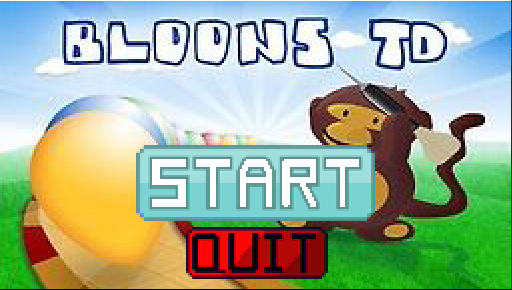

## LDTS_<6><7> - <BLOONS TD>

In this project, you will be able to relive your long-lost joy in life by playing the good ol' Bloons TD. Here, you can fortify your defenses through the help of towers(some in the form of cute little monkeys) which will help you pop the balloons that are coming to get you!

This project was developed by João Lourenço (up202108863@fe.up.pt), Tiago Cruz (up202108810@fe.up.pt) and Tomás Xavier (up202108759@fe.up.pt) for LDTS 2022⁄23.

### IMPLEMENTED FEATURES

- **Image loading** - Now, upon loading the game, the game loads the title-screen image.
- **Mouse press** - When the mouse is pressed and an action is valid (such as clicking the start game button), the game will now perform said action.

### PLANNED FEATURES

> This section is similar to the previous one but should list the features that are not yet implemented. Instead of screenshots you should include GUI mock-ups for the planned features.

- **Radius** - When selecting a tower to buy from the shop, while moving the mouse around to figure out where to place the tower, the game should not only show the tower where the cursor is, but also its range as well.
- **Left upgrade** - While the right upgrade of every tower simply increases its range, the left upgrade should either improve one of the key defining moves that makes that tower special or add a new one, specific to that tower.

### DESIGN

> This section should be organized in different subsections, each describing a different design problem that you had to solve during the project. Each subsection should be organized in four different parts:

- **Problem in Context.** The description of the design context and the concrete problem that motivated the instantiation of the pattern. Someone else other than the original developer should be able to read and understand all the motivations for the decisions made. When referring to the implementation before the pattern was applied, don’t forget to [link to the relevant lines of code](https://help.github.com/en/articles/creating-a-permanent-link-to-a-code-snippet) in the appropriate version.
- **The Pattern.** Identify the design pattern to be applied, why it was selected and how it is a good fit considering the existing design context and the problem at hand.
- **Implementation.** Show how the pattern roles, operations and associations were mapped to the concrete design classes. Illustrate it with a UML class diagram, and refer to the corresponding source code with links to the relevant lines (these should be [relative links](https://help.github.com/en/articles/about-readmes#relative-links-and-image-paths-in-readme-files). When doing this, always point to the latest version of the code.
- **Consequences.** Benefits and liabilities of the design after the pattern instantiation, eventually comparing these consequences with those of alternative solutions.

**Example of one of such subsections**:

------

#### THE JUMP ACTION OF THE KANGAROOBOY SHOULD BEHAVE DIFFERENTLY DEPENDING ON ITS STATE

**Problem in Context**

Due to the nature of this project, one thing we had to do was implement the functions needed for the mouse to work properly (such as MousePressed and MouseHover), however, because we have two different menus, the main menu, with the Start and Quit buttons, and the game menu, when you are actually playing the game, there was a problem since we would have to test different mouse inputs for each type of menu because there were different buttons with different purposes from one menu to another. 

**The Pattern**

We decided to apply the **State** pattern. With this implementation of the **State** pattern, instead of constantly checking where the player is in the game (either in the Main Menu or the Game Menu) and then using that inform to process the mouse input in different ways, the game changes the **state** of the menu and, depending on the **state** the game will behave differently to the mouse inputs it receives.

**Implementation**

The following figure shows how the pattern’s roles were mapped to the application classes.

These classes can be found in the following files:

- [Character](https://web.fe.up.pt/~arestivo/page/courses/2021/lpoo/template/src/main/java/Character.java)
- [JumpAbilityState](https://web.fe.up.pt/~arestivo/page/courses/2021/lpoo/template/src/main/java/JumpAbilityState.java)
- [DoubleJumpState](https://web.fe.up.pt/~arestivo/page/courses/2021/lpoo/template/src/main/java/DoubleJumpState.java)
- [HelicopterState](https://web.fe.up.pt/~arestivo/page/courses/2021/lpoo/template/src/main/java/HelicopterState.java)
- [IncreasedGravityState](https://web.fe.up.pt/~arestivo/page/courses/2021/lpoo/template/src/main/java/IncreasedGravityState.java)

**Consequences**

The use of the State Pattern in the current design allows the following benefits:

- The several states that represent the character’s hability to jump become explicit in the code, instead of relying on a series of flags.
- We don’t need to have a long set of conditional if or switch statements associated with the various states; instead, polimorphism is used to activate the right behavior.
- There are now more classes and instances to manage, but still in a reasonable number.

#### KNOWN CODE SMELLS AND REFACTORING SUGGESTIONS

------

#### DEAD CODE

Currently, the `Reader` class's methods are not being used anywhere in the code, therefore its absence would make the code cleaner, more efficient and easier to understand.

A way to improve the code is simply to delete the class, since that would reduce the number of classes in the project which makes it a bit easier to understand.

### TESTING

- Screenshot of coverage report:

- Link to mutation testing report.

### SELF-EVALUATION

- João Lourenço: 33,3%
- Tiago Cruz: 33,3%
- Tomás Xavier: 33,4%